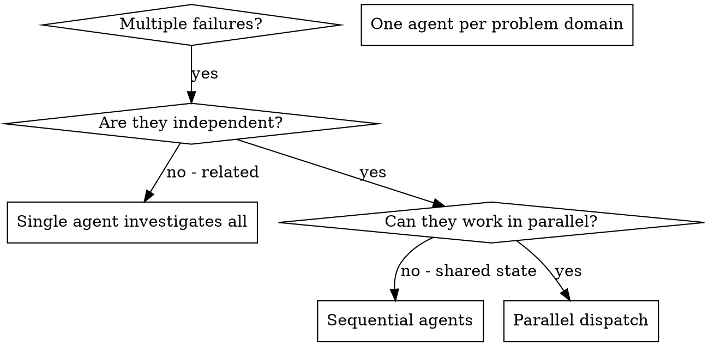

# Dispatching Parallel Agents

## Table of Contents

1. [Overview](#overview)
2. [Quick Reference Checklist](#quick-reference-checklist)
3. [When to Use](#when-to-use)
4. [The Pattern](#the-pattern)
5. [Agent Prompt Structure](#agent-prompt-structure)
6. [Common Mistakes](#common-mistakes)
7. [Verification](#verification)
8. [Key Benefits](#key-benefits)
9. [Reference Files](#reference-files)

## Overview

Multiple unrelated failures (different test files, different subsystems, different bugs) waste time when investigated sequentially. Each investigation is independent and can happen in parallel.

**Core principle:** Dispatch one agent per independent problem domain. Let them work concurrently.

## Quick Reference Checklist

Use this checklist for rapid parallel dispatch:

1. ☐ **Group failures by domain** - Identify independent subsystems
2. ☐ **Verify independence** - Confirm no shared state between problems
3. ☐ **Create focused prompts** - One clear scope per agent ([template](references/agent-prompt-template.md))
4. ☐ **Dispatch in parallel** - Launch all agents simultaneously
5. ☐ **Review summaries** - Read what each agent found
6. ☐ **Check for conflicts** - Verify no overlapping changes
7. ☐ **Run full suite** - Validate all fixes work together

## When to Use



**Use when:**
- 3+ test files failing with different root causes
- Multiple subsystems broken independently
- Each problem can be understood without context from others
- No shared state between investigations

**Avoid when:**
- Failures are related (fixing one might fix others)
- Full system state understanding required first
- Unknown failure cause - investigate before dispatching
- Agents would interfere (editing same files, using same resources)

## The Pattern

### 1. Identify Independent Domains

Group failures by what's broken:
- File A tests: Tool approval flow
- File B tests: Batch completion behavior
- File C tests: Abort functionality

Each domain is independent - fixing tool approval doesn't affect abort tests.

### 2. Create Focused Agent Tasks

Each agent gets:
- **Specific scope:** One test file or subsystem
- **Clear goal:** Make these tests pass
- **Constraints:** Don't change other code
- **Expected output:** Summary of what found and fixed

### 3. Dispatch in Parallel

```typescript
// In Claude Code / AI environment
Task("Fix agent-tool-abort.test.ts failures")
Task("Fix batch-completion-behavior.test.ts failures")
Task("Fix tool-approval-race-conditions.test.ts failures")
// All three run concurrently
```

### 4. Review and Integrate

When agents return:
- Read each summary
- Verify fixes don't conflict
- Run full test suite
- Integrate all changes

## Agent Prompt Structure

Good agent prompts are:
1. **Focused** - One clear problem domain
2. **Self-contained** - All context needed to understand the problem
3. **Specific about output** - What should the agent return?

See the complete reusable template: **[Agent Prompt Template](references/agent-prompt-template.md)**

## Common Mistakes

| Anti-Pattern | Problem | Fix |
|-------------|---------|-----|
| "Fix all the tests" | Too broad, agent gets lost | Scope to one file/subsystem |
| "Fix the race condition" | No location context | Paste error messages and test names |
| No constraints | Agent might refactor everything | Add "Do NOT change production code" |
| "Fix it" | Vague output expectation | "Return summary of root cause and changes" |

## Verification

After agents return:
1. **Review each summary** - Understand what changed
2. **Check for conflicts** - Did agents edit same code?
3. **Run full suite** - Verify all fixes work together
4. **Spot check** - Agents can make systematic errors

## Key Benefits

1. **Parallelization** - Multiple investigations happen simultaneously
2. **Focus** - Each agent has narrow scope, less context to track
3. **Independence** - Agents don't interfere with each other
4. **Speed** - 3 problems solved in time of 1

## Reference Files

| File | Description |
|------|-------------|
| [Agent Prompt Template](references/agent-prompt-template.md) | Reusable template with placeholder variables |
| [Example Session](references/example-session.md) | Real debugging session demonstrating the pattern |
